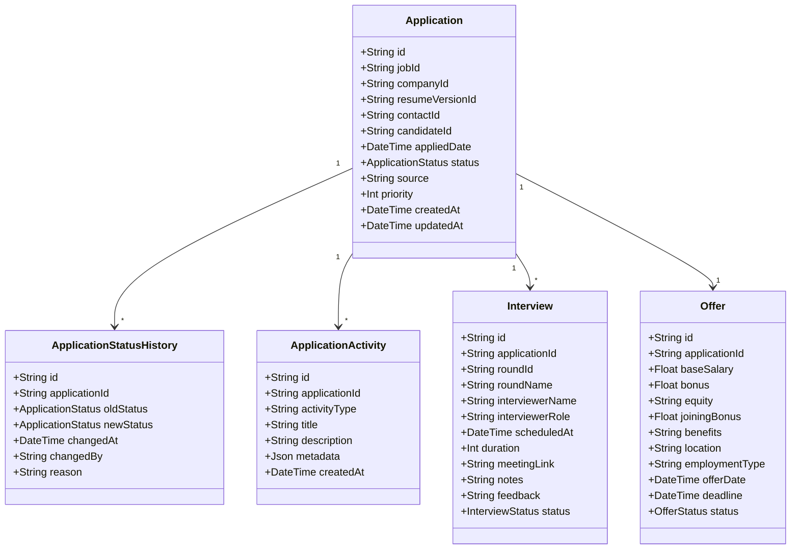

# Application Management & Pipeline Engine Documentation

This document describes the design, status life-cycle, scoring priorities, and implementation details of Phase 8 — Application Management & Pipeline Engine.

## Architecture & Module Organization

The system is split into three decoupled components using a Feature-Based Architecture:

1. **Database Layer (`schema.prisma`)**: Ten new relational database models track applications, notes, documents, interviews, offers, and history.
2. **Business Core (`agents/application-manager`)**: Encapsulates scoring heuristics, default follow-up reminders, and status transition logging.
3. **API Endpoints (`apps/api`)**: Fastify routing parses query/body inputs and interacts with the application-manager agent services.
4. **Kanban Dashboard (`apps/dashboard`)**: A Next.js front-end Kanban board view supporting native drag-and-drop to update statuses.

## Database Design



## Status Flow Lifecycle

Every transition is tracked in `ApplicationStatusHistory`. The Kanban pipeline groups the 18 granular database statuses into 7 user-friendly board columns:

| Kanban Column      | Granular Database Statuses                                                                      | Drop Transition Target |
| ------------------ | ----------------------------------------------------------------------------------------------- | ---------------------- |
| **Discovered**     | `DISCOVERED`                                                                                    | `DISCOVERED`           |
| **Shortlisted**    | `SHORTLISTED`                                                                                   | `SHORTLISTED`          |
| **Ready to Apply** | `READY_TO_APPLY`                                                                                | `READY_TO_APPLY`       |
| **Applied**        | `APPLIED`, `OUTREACH_SENT`, `REPLIED`                                                           | `APPLIED`              |
| **Interviewing**   | `PHONE_SCREEN`, `TECHNICAL_ROUND`, `SYSTEM_DESIGN`, `TAKE_HOME`, `MANAGER_ROUND`, `FINAL_ROUND` | `PHONE_SCREEN`         |
| **Offer**          | `OFFER_RECEIVED`, `OFFER_ACCEPTED`, `OFFER_DECLINED`                                            | `OFFER_RECEIVED`       |
| **Rejected**       | `REJECTED`, `WITHDRAWN`, `ARCHIVED`                                                             | `REJECTED`             |

## Priority Scoring Engine

The Priority Score (0-100) is dynamically recalculated on status transitions or job modifications based on:

1. **Match Score (30%)**: Cosmic/cosine semantic fit matching score.
2. **Company Quality (20%)**: Based on headcount, funding stage (Series A/B/C/D, IPO/Public).
3. **Salary Max (15%)**: Based on salary range (e.g. >= $200k gives 100 points, scaling down).
4. **Remote status (15%)**: Remote (100 pts), Hybrid (80 pts), Onsite (50 pts).
5. **Interview / Response Activity (20%)**: Offers/finals yield 95-100 pts, phone screens 75 pts, rejected 10 pts.

## Follow-Up Reminder Engine

On application creation, three follow-up reminders are automatically scheduled:

- **Day 3**: Response check or first follow-up email.
- **Day 7**: Connect with recruiters / hiring managers on LinkedIn.
- **Day 14**: Check-in and decision whether to archive/follow up.
- **Custom**: Custom deadline dates can be manually scheduled through the details dashboard interface.

## Verification & Tests

Vitest suites test the logic completely:

```bash
pnpm --filter @job-hunter/application-manager test
```

Tests cover:

- Application Creation & Priority Calculation
- Status Transitions & History Logs
- Interview Scheduling & Auto-Status matching
- Offer logging & state progression
