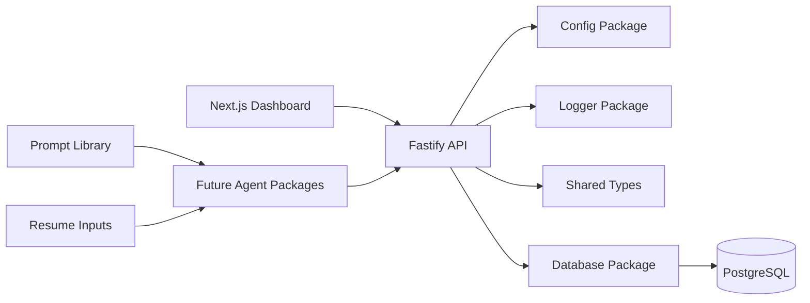

# Architecture

## System Architecture

The AI Job Hunting Agent is structured as a TypeScript monorepo with separate runtime apps and
shared packages. The current phase provides infrastructure and application boundaries only; job
search business logic will be added in later phases.

## Package Structure

- `apps/dashboard`: Next.js 15 dashboard using the App Router and Tailwind CSS.
- `apps/api`: Fastify API with health route, environment loading, structured logging, and central
  error handling.
- `agents/job-finder`: Future job discovery agent boundary.
- `agents/resume-matcher`: Future resume-to-job scoring agent boundary.
- `agents/contact-finder`: Future hiring manager and referral discovery agent boundary.
- `agents/outreach-agent`: Future personalized outreach generation agent boundary.
- `agents/resume-agent`: Future resume tailoring and versioning agent boundary.
- `packages/database`: Prisma and PostgreSQL integration package.
- `packages/shared`: Shared TypeScript contracts, response envelopes, pagination, and enums.
- `packages/logger`: Reusable Pino logger package.
- `packages/config`: Centralized environment variable loader.
- `prompts`: Future prompt templates and evaluation fixtures.
- `resume`: Future canonical resume inputs and generated resume variants.

## Future Agent Architecture

Each agent should be isolated behind a small interface and orchestrated by the API layer or a future
workflow runner. Agents should not directly own cross-agent persistence rules. Shared data contracts
belong in `packages/shared`, persistence belongs in `packages/database`, and provider-specific
configuration belongs in `packages/config`.

Planned agents:

- Job Finder: discovers opportunities from job boards, career pages, and search providers.
- Resume Matcher: scores roles against resume data and explains match quality.
- Contact Finder: identifies hiring managers, recruiters, alumni, and referral paths.
- Outreach Agent: drafts personalized messages for referrals, recruiters, and hiring managers.
- Resume Agent: creates targeted resume variants for specific opportunities.

## Data Flow

1. The dashboard calls the Fastify API.
2. The API validates requests, applies orchestration rules, and logs structured events.
3. Future agents perform bounded tasks and return typed outputs.
4. The database package persists normalized records through Prisma.
5. Shared response envelopes and enums keep frontend, backend, and agents aligned.

Later phases should add authentication, persistence models, queueing, agent execution, observability,
provider integrations, and evaluation workflows.
