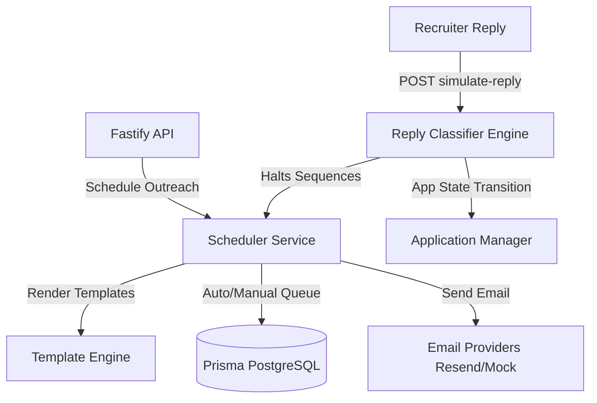

# Phase 9: Communication Center & Follow-Up Automation

The Communication Center handles all inbound and outbound email interactions with recruiters, referral contacts, hiring managers, and founders. It automates scheduled follow-up sequences while guaranteeing recruiter replies or rejections automatically halt pending emails.

---

## Technical Architecture

The module is structured into three primary layers:

1. **Core Package (`@job-hunter/communication-agent`)**: Provider adapters, template engine, reply classifier, and queue scheduler.
2. **API Routes (`apps/api/src/modules/communication/`)**: REST interface endpoints.
3. **Dashboard UI (`apps/dashboard/app/`)**: Responsive panels to track logs, view conversation histories, edit templates, and monitor analytics.

---

## Core Services

### 1. Template Rendering Engine

Resolves variables dynamically from candidate records (FullName, projects, skills), company contacts (names), and applications (Job Title, matchScore) and replaces `{{variable}}` templates.

- **Service**: [template-engine.ts](file:///d:/projects/job-hunter-agent/agents/communication-agent/src/services/template-engine.ts)

### 2. Queue Scheduler & Approval Flow

Configured via `EMAIL_APPROVAL_MODE` environment variable:

- `MANUAL` (Default): All outreach goes to `DRAFT` status and requires manual approval via the API/Dashboard before transmission.
- `AUTO`: Automatically approves and queues messages for direct delivery.
- `HYBRID`: Automatically schedules/sends `FOLLOW_UP` messages, but requires manual approval for cold initial outreach.
- **Service**: [scheduler.ts](file:///d:/projects/job-hunter-agent/agents/communication-agent/src/services/scheduler.ts)

### 3. Reply Detection & Sentiment Analysis

Parses incoming email responses, calculates sentiment, and runs classification heuristics:

- **Categories**: `OUT_OF_OFFICE`, `REJECTED`, `INTERESTED`, `REFERRAL_PROVIDED`, `INTERVIEW_REQUEST`, `FOLLOW_UP_REQUEST`, `POSITIVE`, `UNKNOWN`.
- **Automation Rules**:
  - Any reply matching a thread automatically transitions all `PENDING` or `SCHEDULED` follow-ups to `CANCELLED`.
  - If category is `REJECTED`, the job application status transitions automatically to `REJECTED`.
  - If category is `INTERVIEW_REQUEST` or `INTERESTED`, the job application status transitions to `REPLIED`.
- **Service**: [reply-detector.ts](file:///d:/projects/job-hunter-agent/agents/communication-agent/src/services/reply-detector.ts)

---

## API Endpoints Reference

| Method | Endpoint                         | Description                                                            |
| :----- | :------------------------------- | :--------------------------------------------------------------------- |
| `GET`  | `/communications`                | Paginated outbox logs list with filter capabilities.                   |
| `GET`  | `/communications/:id`            | Detailed individual email status log.                                  |
| `GET`  | `/threads`                       | Thread index of recruiter conversations.                               |
| `GET`  | `/threads/:id`                   | Timeline conversation list, scheduled follow-ups, and reply analytics. |
| `POST` | `/communications/send`           | Queue immediately a template-driven email.                             |
| `POST` | `/communications/schedule`       | Schedule email for a future target date.                               |
| `POST` | `/communications/approve`        | Transition a `DRAFT` email to `APPROVED` and trigger send.             |
| `POST` | `/communications/cancel`         | Cancel follow-up sequences for a conversation.                         |
| `GET`  | `/templates`                     | View email template collections.                                       |
| `POST` | `/templates`                     | Create a new reusable template.                                        |
| `POST` | `/communications/simulate-reply` | Simulate receiving an inbound recruiter reply.                         |

---

## Dashboard Interface Pages

1. **Outbox Log Tracker (`/communications`)**: Unified outbox panel showing email deliveries, send statuses, and manual approval triggers for drafts.
2. **Conversation Threads (`/threads`)**: List of active outreach threads grouped by job opportunity.
3. **Thread Details (`/threads/[id]`)**: Chronological timeline bubble view showing outbound emails, inbound classification analytics, follow-up sequences, and reply simulators.
4. **Template Library (`/templates`)**: View variable lists, draft subject and body copy, and add new reusable templates.
5. **Outreach Analytics (`/analytics/communications`)**: Displays deliverability rates, open rates, response sentiment ratios, and response categories.
