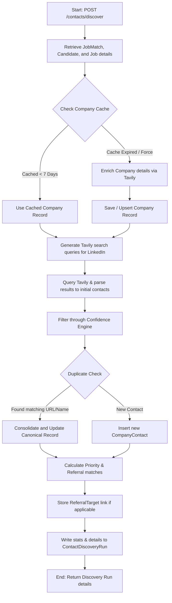

# Hiring Manager & Referral Discovery Engine Documentation

The Hiring Manager & Referral Discovery Engine (implemented in `agents/contact-finder`) automates the discovery, scoring, and recommendation of key decision-makers and warm introduction referrers associated with matched job opportunities.

---

## 1. System Architecture

The engine is built inside `agents/contact-finder` as a modular set of single-responsibility services.

```
agents/contact-finder/
├── src/
│   ├── types/
│   │   └── index.ts                 # Types and Interfaces
│   ├── services/
│   │   ├── tavily-service.ts        # Search & HTML parsing (LinkedIn / Company data)
│   │   ├── firecrawl-service.ts     # Career/team pages scraping & parsing
│   │   ├── confidence-engine.ts     # Confidence score calculation
│   │   ├── ranking-engine.ts        # Priority ranking calculation
│   │   ├── referral-discovery.ts    # Shared history (alumni, ex-employer) matching
│   │   ├── recommendation-engine.ts # Recommendation selector (Overall, EM, Recruiter)
│   │   └── discovery-pipeline.ts    # Pipeline orchestrator & duplicate resolver
│   └── index.ts                     # Entry exports
```

### Search & Crawling Infrastructure

- **Tavily Search API**: Performs structured Google search queries limited to `site:linkedin.com/in` to discover candidates, decision-makers, and founders dynamically.
- **Firecrawl Scrape API**: Crawls target company career portals or about/team directories to scrape text listings, converting HTML to markdown which we parse for bio links.

---

## 2. Pipeline Data Flow

When a `POST /contacts/discover` request triggers contact discovery for a matched job, the following pipeline executes:



---

## 3. Priority Ranking Engine

The priority ranking score (0 - 100) indicates the outreach value of a contact. It is calculated dynamically based on six criteria:

| Factor                     | Description                                                                            | Score Range |
| :------------------------- | :------------------------------------------------------------------------------------- | :---------- |
| **Hiring Authority**       | Power within organization (Hiring Manager = 25, CEO/Founder = 22, CTO = 20, EM = 18)   | 5 - 25      |
| **Role Relevance**         | Value of role categories (Hiring Manager = 20, EM = 18, CTO = 16, Recruiter = 14)      | 5 - 20      |
| **Engineering Relevance**  | Alignment with technical job matches (Tech roles match tech jobs = 15, Recruiters = 6) | 2 - 15      |
| **Likelihood to Respond**  | Response probability (Recruiter = 15, Referral = 14, Engineer = 10, CTO/CEO = 5)       | 5 - 15      |
| **Seniority**              | Seniority tags (Executive/Founder = 15, Lead = 13, Senior = 11, Mid = 8, Junior = 4)   | 4 - 15      |
| **Connection to Position** | Direct team connection (Alumni referral = 10, Recruiter/Hiring team = 8, Default = 2)  | 2 - 10      |

---

## 4. Confidence Engine

The confidence score (0 - 100) evaluates the likelihood of the profile being accurate and correct:

1. **Profile Match (Max 20)**: Checks if the LinkedIn URL slug or title text contains the target company name.
2. **Department Match (Max 20)**: Checks if the contact is in the target department (e.g. engineering role matches engineering job description).
3. **Role Match (Max 20)**: Verified categorization validation.
4. **Job Match (Max 20)**: Evaluates shared technical stack keywords (e.g., React, Node, Python) in the contact's title and the job's requirements.
5. **Source Quality (Max 20)**: Verified direct profiles (e.g., LinkedIn URL = 20, Firecrawl Scraped = 18, General Search = 15).

Profiles failing to meet a **minimum confidence threshold of 50** are automatically filtered out.

---

## 5. Warm Referral Discovery

Potential referral candidates are evaluated and ranked (Rank 1 - 5) based on shared backgrounds:

1. **Priority 1 (SAME_TEAM)**: Contact is an Engineer or Lead with direct specialty match (e.g. both Frontend or Backend).
2. **Priority 2 (SAME_DEPARTMENT)**: Contact is in Engineering/Product and candidate is applying for a technical role.
3. **Priority 3 (TECHNICAL)**: Contact is a general peer engineer.
4. **Priority 4 (STARTUP)**: Company is a startup and reference works in a core builder role.
5. **Priority 5 (ALUMNI)**: Contact shares a university (`CandidateEducation`) or is an alumnus of a candidate's past employer (`CandidateExperience`).

---

## 6. API Endpoints

- `GET /contacts`: Paginated list of contacts with filters (`search`, `category`, `minPriority`, `minConfidence`, `status`).
- `GET /contacts/:id`: Single contact details including Company profile, Department, and Referral opportunities.
- `GET /contacts/company/:company`: Lists contacts by company name (case-insensitive).
- `GET /contacts/recommended`: Top contacts (priority >= 70, confidence >= 60).
- `GET /contacts/referrals`: Uncovers referral matches.
- `POST /contacts/discover`: Start background discovery on a `jobMatchId`. Body format:
  ```json
  {
    "jobMatchId": "0987f89a-12bc-34de-56fg-78hijklm9012",
    "forceRefresh": false
  }
  ```

---

## 7. Extending Enrichment Providers

The system is designed for modular scaling. To integrate third-party data enrichment APIs (Apollo, Clearbit, Hunter, People Data Labs):

1. **Extend `CompanyContact` Schema**: Add email, phone, location, and metadata fields as nullable.
2. **Implement Enrichment Service**: Create `src/services/hunter-service.ts` or `src/services/apollo-service.ts`.
3. **Plug into the Pipeline**: In `discovery-pipeline.ts`, pass resolved names and company URLs to the enrichment providers to resolve professional emails and phone numbers before database insertion.
