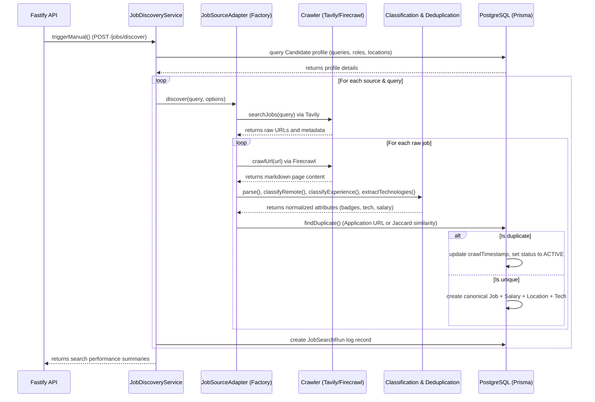

# Job Discovery Agent

The Job Discovery Agent is an autonomous pipeline built to search multiple job boards, crawl listings, parse structured metadata, run classifiers, deduplicate records, and store them in a unified format in a PostgreSQL database.

---

## Architecture

The agent is designed as a standalone workspace package (`@job-hunter/job-finder`) that exposes service layers, crawlers, engines, and scheduler functions. The main API server (`@job-hunter/api`) mounts and exposes these features via Fastify HTTP endpoints.

---

## Database Design

The schema adds several normalized models linked to the canonical job table:

- **`Job`**: Primary entity storing title, company, description, raw locations, URLs, crawl times, status, and freshness.
- **`JobSource`**: Metadata table tracking crawl status and freshness metric per platform.
- **`JobLocation`**: Geography table linking multiple location tuples (City, Country) and remote status.
- **`JobSalary`**: Normalized salary records tracking min/max bounds, currency (default USD), and interval (YEAR/HOURLY).
- **`JobTechnology`**: Relational lookup table storing unique tag lists of programming languages and libraries.
- **`JobTag`**: Tagging table to classify roles or generic properties.
- **`JobSearchRun`**: Operation logging tracking query execution logs, job count deltas, durations, and errors.

---

## Deduplication Strategy

To prevent spam and listing aggregation noise, a multi-tier deduplication check is run prior to creating database entries:

1. **Application URL Matching**: If two opportunities have matching application URLs, they are instantly flagged as duplicate.
2. **Text Overlap (Jaccard Similarity)**: If company names and job titles match after alphanumeric case-insensitive normalization, a Jaccard token coefficient is computed on the job descriptions:
   $$\text{Jaccard}(A, B) = \frac{|A \cap B|}{|A \cup B|}$$
   If the Jaccard similarity coefficient is $\ge 0.75$, the postings are merged.
3. **Merging Logic**: When a duplicate is discovered, the existing record's `crawlTimestamp` is updated to current, and its status is marked as `ACTIVE`, keeping a single canonical record and saving database storage.

---

## Future Expansion Plan

To extend the system to other platforms, new adapters can be written by implementing the base `JobSourceAdapter` abstract class.

### Recommended Adapters to add:

- **LinkedIn / Indeed / Naukri**: These require browser scraping wrappers or API hooks.
- **Cutshort / Instahyre**: Specialized API parsers extracting tech recruitment boards.
- **Direct Career Page scrapers**: Leverages Tavily to auto-detect Lever/Greenhouse links directly on company websites.
