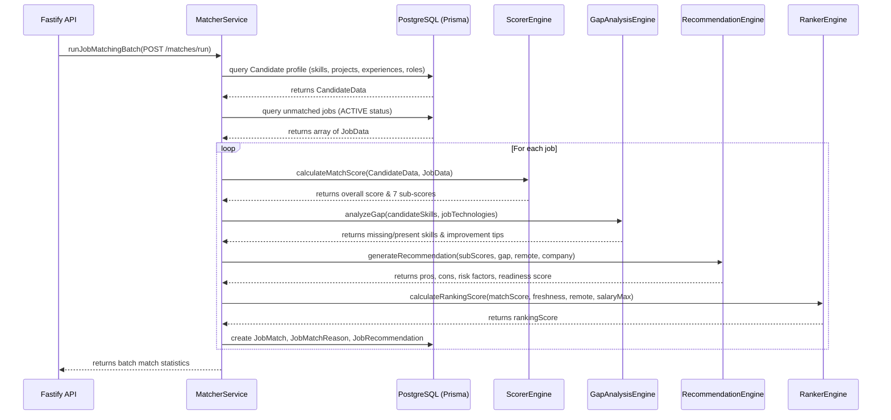

# AI Job Matching & Scoring Engine

The AI Job Matching & Scoring Engine is a modular, high-performance system designed to evaluate crawled jobs against a candidate's profile. It calculates detailed sub-scores, compiles algorithmic recommendations (pros, cons, risks, preparation tips), and computes priority ranks to highlight the best opportunities.

---

## Architecture

The matching engine is designed as a standalone workspace package (`@job-hunter/job-matcher`) that coordinates database tables, similarity calculations, and recommendation rules. The Fastify API server (`@job-hunter/api`) exposes these features via HTTP endpoints.

---

## Scoring Weight Distribution

The match score ($S_{\text{match}}$) is a weighted sum of 7 specialized dimensions evaluating the alignment of the candidate's skills and preferences with the job requirements:

| Dimension            | Weight | Description                | Calculation Strategy                                                            |
| :------------------- | :----- | :------------------------- | :------------------------------------------------------------------------------ |
| **Skills Match**     | 30%    | Direct tech stack coverage | Exact set overlap of candidate skills with job technologies.                    |
| **Experience Match** | 20%    | Seniority alignment        | Compares candidate years of experience against job seniority classification.    |
| **Project Match**    | 15%    | Past work relevance        | Cosine similarity between candidate projects and job description.               |
| **Role Match**       | 15%    | Target job title alignment | Exact matching and text similarity of target roles vs. job titles.              |
| **Startup Fit**      | 10%    | Work culture preference    | Evaluates candidate startup preference against job origin (e.g. YC, Wellfound). |
| **Location Fit**     | 5%     | Workspace setup alignment  | Cross-references remote/hybrid/onsite requirements with candidate preference.   |
| **Compensation Fit** | 5%     | Salary expectations        | Compares job compensation bounds against benchmark expectations.                |

$$\text{Match Score} = \sum (\text{SubScore}_i \times \text{Weight}_i)$$

---

## Ranking & Recommendation Engine

To prioritize applications, the **Ranker** computes a final ranking score which incorporates job freshness and premium candidate incentives:

$$\text{Ranking Score} = S_{\text{match}} + \text{Freshness Bonus} + \text{Salary Bonus} + \text{Remote Bonus}$$

### Bonuses Applied:

- **Salary Bonus**: Up to $+15$ points for highly compensating opportunities (salary max $\ge \$150\text{k}$).
- **Remote Bonus**: Up to $+10$ points for fully remote flexible roles.
- **Freshness Bonus**: Sourced directly from job metadata to reward newly crawled postings.

### Recommendation & Gap Analysis

The recommendation system algorithmically analyzes the candidate's missing technologies and sub-scores to generate:

1. **Technology Gap Analysis**: Explicitly highlights missing tools (e.g. Docker, Kubernetes) and proposes learning improvement steps.
2. **Apply Guidance (Pros & Cons)**: Outlines strengths (e.g. remote flexibility, high stack alignment) and caution points (e.g. onsite requirement, seniority mismatches).
3. **Interview Readiness Score**: A specialized metric assessing the likelihood of technical screening clearance based on skills and experience scores.

---

## Verification & Tests

Unit and integration tests are powered by **Vitest** under `agents/job-matcher/tests/`:

- `tests/similarity.test.ts`: Verifies TF-IDF local vectors, clean tokens, Jaccard overlaps, and similarity boundaries.
- `tests/gap-analysis.test.ts`: Validates technology classification boundaries and tips.
- `tests/scoring-and-ranking.test.ts`: Evaluates sub-scores, ranking formula additions, and recommendation text bounds.
