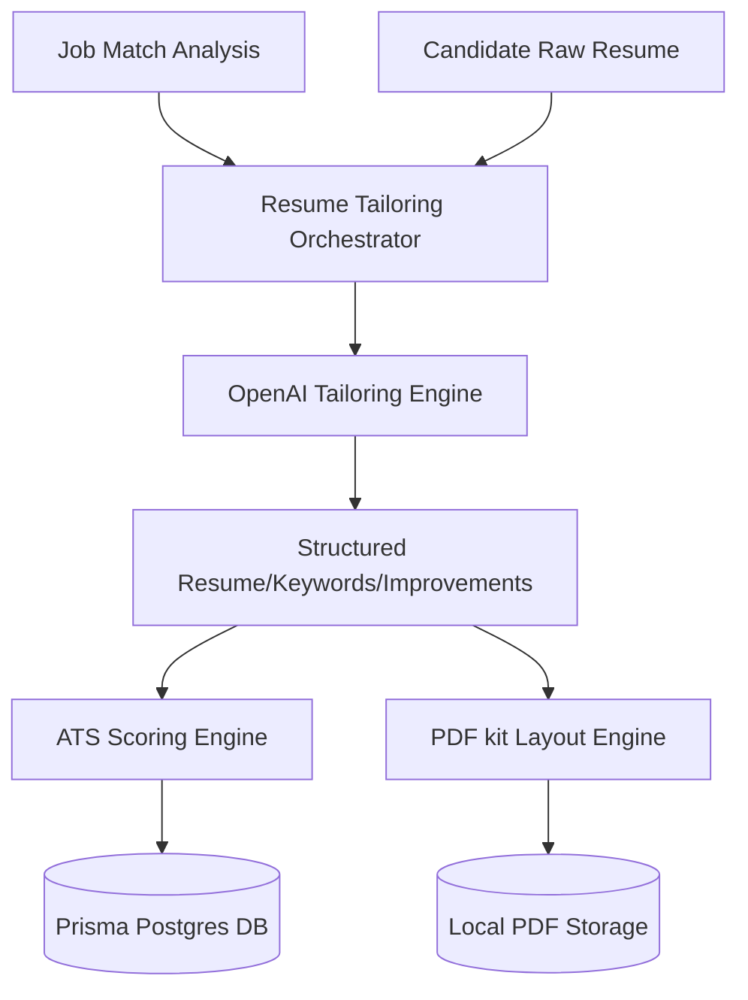

# Resume Tailoring Engine & ATS Optimization Specialist

This document covers the architectural layout, optimization philosophy, scoring engines, and rendering pipeline of the Job Hunter Resume Agent.

---

## Architecture Layout

The Resume Agent is built as a self-contained, workspace-isolated agent in `agents/resume-agent`. It integrates directly with the main database client and the core OpenAI provider.

---

## Resume Optimization Rules

To ensure strict compliance with formatting standards and preserve truthfulness:

### 1. Safety Guidelines (No Fakes)

- **Zero Fabrication:** The model is prohibited from fabricating metrics, skills, degrees, or certifications.
- **Rearrangement:** Highlight relevance solely via reordering existing skills and matching technology catalogs.
- **Linguistic Polish:** Polish experience descriptions using high-impact keywords matching the job context, keeping claims grounded in existing descriptions.

### 2. Layout Guidelines (Single Column)

- **Formatting:** Keep fonts regular (Helvetica, Helvetica-Bold).
- **Compliance:** Multi-column designs, tables, icons, and diagrams are excluded to prevent parser errors in applicant tracking systems.

---

## ATS Strategy

The ATS Scoring system ranks resumes on a `0-100` scale:

| Scoring Factor          | Weight | Evaluation Method                                     |
| :---------------------- | :----- | :---------------------------------------------------- |
| **Keyword Match**       | 25%    | Ratio of matches vs total job target keywords         |
| **Role Alignment**      | 20%    | Category matching of target position title            |
| **Skills Match**        | 20%    | Tech skills alignment                                 |
| **Project Match**       | 15%    | Matching projects with job description requirements   |
| **Format Analysis**     | 10%    | Detection of tables, HTML, or length limits           |
| **Readability Density** | 10%    | Density of accomplishments formatted as bullet points |

---

## Generation Pipeline

1. **Extraction:** Read Candidate details and Job Description.
2. **Analysis:** Extract primary and secondary keywords.
3. **Tailoring:** Instruct LLM to reorder and format the resume into Markdown.
4. **Scoring:** Compute ATS Score and suggestions list.
5. **Storage:** Commit records (`ResumeVersion`, `ResumeOptimization`, `ResumeScore`, `ResumeKeyword`) to DB.
6. **Rendering:** Draw the optimized Markdown to a PDF file using `pdfkit`.
7. **Delivery:** Stream PDF buffers or render Markdown comparison views via dashboard pages.
