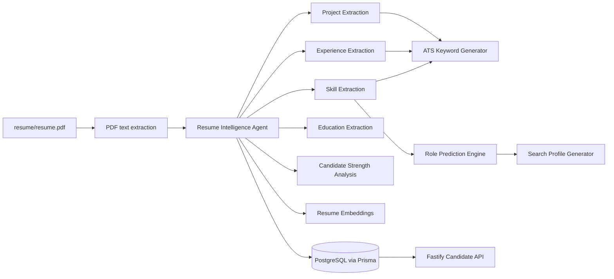
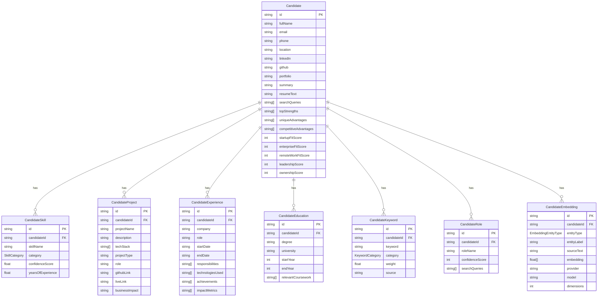

# Resume Intelligence Engine

## Purpose

The Resume Intelligence Engine converts `resume/resume.pdf` into structured candidate intelligence
for future job matching, referral discovery, outreach, and analytics agents.

This phase does not implement job search. It focuses only on resume parsing, candidate profiling,
skill extraction, ATS keyword generation, role targeting, search profile generation, strength
analysis, embeddings, and PostgreSQL persistence.

## Architecture



## Data Flow

1. `agents/resume-intelligence` reads `resume/resume.pdf`.
2. PDF text is normalized into resume text.
3. Candidate identity, skills, experience, projects, and education are extracted.
4. ATS keywords are generated from skills, experience technologies, project tech stacks, and roles.
5. Target roles are scored from 0 to 100.
6. Search queries are generated from the strongest roles and technical signals.
7. Strength analysis scores startup, enterprise, remote, leadership, and ownership fit.
8. Embeddings are generated for the full resume, each experience, each project, and each skill.
9. The complete profile is stored in PostgreSQL through Prisma.
10. Fastify exposes read APIs for future agents and dashboards.

## Database ERD



## API Documentation

All endpoints return the latest generated candidate profile data.

- `GET /candidate/profile`: full candidate profile with skills, projects, experience, education,
  keywords, and roles.
- `GET /candidate/skills`: extracted skills grouped by skill records.
- `GET /candidate/projects`: extracted project records.
- `GET /candidate/experience`: extracted experience records.
- `GET /candidate/roles`: predicted target roles and search queries.
- `GET /candidate/analysis`: top strengths, competitive advantages, fit scores, and generated
  search profile.

If no profile exists yet, endpoints return:

```json
{
  "success": false,
  "error": {
    "code": "CANDIDATE_PROFILE_NOT_FOUND",
    "message": "No candidate profile has been generated yet."
  }
}
```

## Commands

Generate and store resume intelligence after placing the resume at `resume/resume.pdf`:

```bash
pnpm --filter @job-hunter/database db:migrate
pnpm --filter @job-hunter/resume-intelligence dev -- resume/resume.pdf --persist
```

Run without persistence:

```bash
pnpm --filter @job-hunter/resume-intelligence dev -- resume/resume.pdf
```

## Future Improvements

- Add OpenAI structured output extraction for richer profile parsing.
- Add OCR fallback for scanned resumes.
- Add resume versioning and diffing.
- Add human review workflows for low-confidence fields.
- Add vector database mirroring for `CandidateEmbedding` rows using Pinecone, Qdrant, or pgvector.
- Add background jobs for long-running parsing and embedding generation.
- Add field-level provenance from PDF page and text span locations.
